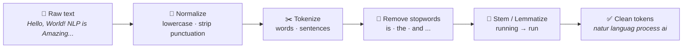
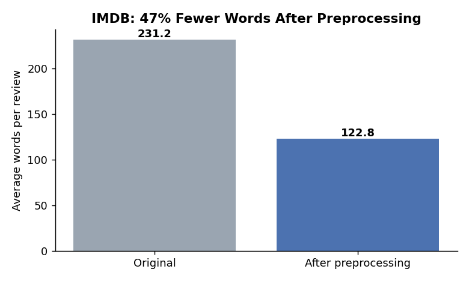
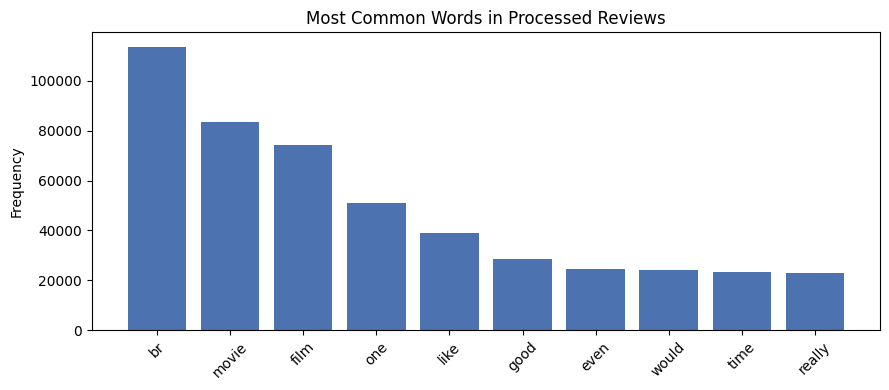

# 📝 NLP Fundamentals: Text Preprocessing with NLTK

[](https://colab.research.google.com/github/MMujtabaX/NLP1/blob/main/Introduction_to_NLP_and_Text_Processing.ipynb)


The first step of almost every NLP pipeline is turning messy human text into clean, consistent tokens. This notebook builds that pipeline step by step with **NLTK** (normalization, tokenization, stopword removal, stemming and lemmatization) and applies it to **50,000 IMDB movie reviews**.

## 🔄 The Preprocessing Pipeline



| Step | Technique | Example |
|------|-----------|---------|
| Normalization | Lowercasing, regex cleanup | `"Let's explore TEXT!"` → `"lets explore text"` |
| Tokenization | `word_tokenize`, `sent_tokenize` | A paragraph → 8 sentences / word tokens |
| Stopword removal | NLTK English list (198 words) | `This is a simple example` → `simple example` |
| Stemming | `PorterStemmer` | `implemented` → `implement`, `language` → `languag` |
| Lemmatization | `WordNetLemmatizer` + POS tags | `was` → `be`, `used` → `use` |

## 🎬 Case Study: 50,000 IMDB Reviews

The full pipeline applied to the IMDB Movie Reviews dataset (25,000 positive / 25,000 negative).

<p align="center">
  
</p>

Preprocessing cut the average review from **231 to 123 words (−47%)**, removing words that carry little meaning while keeping the content.

<p align="center">
  
</p>

**The most common "word" is `br`, with 113,783 occurrences.** IMDB reviews contain HTML line breaks (`<br />`). Removing punctuation strips the `<`, `/` and `>`, but leaves the letters `br` behind as if they were a word. It's a good reminder to **inspect your data after preprocessing**: real text needs **HTML tag removal** before punctuation cleanup.

After `br`, the top words (`movie`, `film`, `one`, `like`, `good`) are domain words that appear in nearly every review. They're candidates for a **custom, domain-specific stopword list**.

## 🌱 Stemming vs Lemmatization

| Word | Porter stem | Lemma (default) | Lemma (with POS tag) |
|------|-------------|-----------------|----------------------|
| was | wa | wa ❌ | **be** ✅ |
| as | as | a ❌ | **as** ✅ |
| implemented | implement | implemented | **implement** |
| used | use | used | **use** |
| language | languag | language | language |

- **Stemming** chops suffixes by rule. It's fast but produces non-words like `languag` and `comput`.
- **Lemmatization** returns real dictionary words, but **only works properly with a part-of-speech tag**. By default `WordNetLemmatizer` assumes every word is a noun, which is why `was` → `wa` and `as` → `a`. The notebook fixes this by POS-tagging each sentence and passing the tags to the lemmatizer.

## 📚 What's Covered

- What NLP is and where it's used (sentiment analysis, chatbots, translation, summarization, speech)
- Regex-based text cleaning, including emoji and Unicode codes in real Wikipedia text
- Word and sentence tokenization (and why `split()` isn't enough)
- Manual vs NLTK stopword lists
- A reusable `preprocess_text()` function
- Porter stemming vs WordNet lemmatization, with POS-aware lemmatization

## 🚀 Run It

Click the **Open in Colab** badge above and choose **Runtime → Run all**. NLTK resources and the IMDB dataset download automatically. The full run takes about 2–3 minutes.

```bash
pip install nltk pandas matplotlib scikit-learn
```

## 🔮 Next Steps

- Strip HTML tags (e.g. with `BeautifulSoup` or a regex) before normalization
- Turn clean tokens into features with **Bag-of-Words** and **TF-IDF**
- Train a sentiment classifier and measure how much preprocessing helps
- Compare NLTK with **spaCy**'s tokenizer and lemmatizer

## 🙏 Acknowledgements

Based on NLP course material (Session 1); run, debugged and extended by me. IMDB data from the [Kaggle IMDB 50K Movie Reviews dataset](https://www.kaggle.com/datasets/lakshmi25npathi/imdb-dataset-of-50k-movie-reviews).

## 👤 Author

**Muhammad Mujtaba Khan Suri** — CS @ UBIT, University of Karachi
[GitHub](https://github.com/MMujtabaX)
